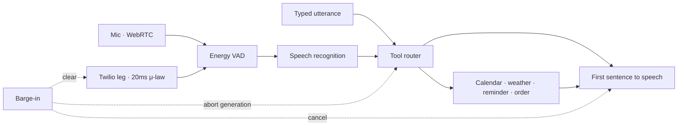
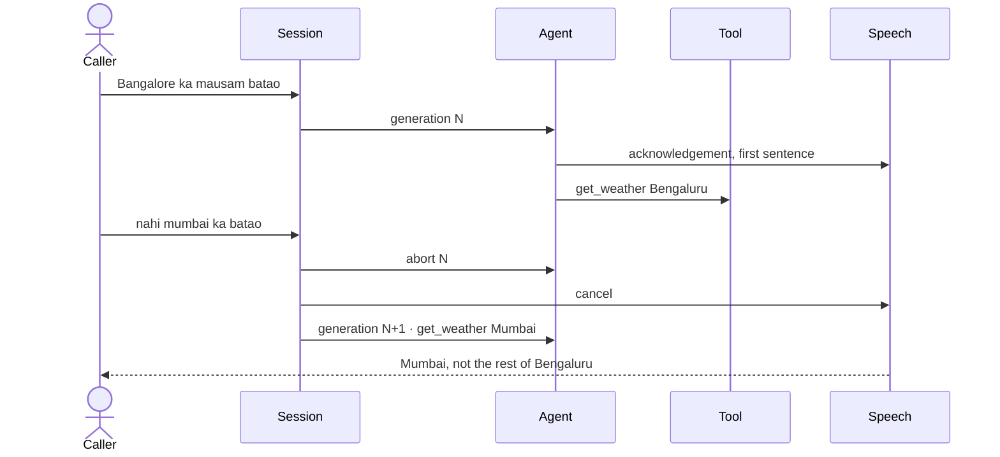

<h1 align="center">Echo</h1>
<p align="center">
  A duplex voice agent. Speak over it, and the turn it was about to finish is gone.
</p>
<p align="center">
  <a href="https://skx56.github.io/Echo/"><strong>Open the live demo</strong></a>
  ·
  <a href="https://skx56.github.io/">Portfolio</a>
</p>

Echo is a browser session that runs speech in, a tool-calling agent, and speech out on one clock. A new utterance cancels the generation that is already in flight: the agent stream, the TTS queue, and, on the phone leg, the buffered carrier audio.

You can talk, type, interrupt a reply mid-sentence, or run the Hinglish bench on the same session that records time to first audio and barge-in stop latency.

## What you can try

| You say | What happens |
| --- | --- |
| kal subah 10 baje dentist book karo | Books Dentist tomorrow at 10:00 and answers in Hinglish |
| Bangalore ka mausam batao | Looks up Bengaluru, then you can cut in with “nahi mumbai ka batao” |
| yaar remind kar dena 6 baje gym | Sets a gym reminder at 18:00 — unmarked evening, not 06:00 |
| order 4821 ka status kya hai | Looks up the order |
| what's on my calendar today | Reads today’s calendar in English if you asked in English |
| kal milte hain | Asks you to be specific. It does not invent a meeting |

Headphones help. Echo cancellation is imperfect, and the agent should not hear itself.

## Architecture

A turn enters one session. The session owns a generation id. Anything still running from the previous id is aborted before the new turn plans a tool.





The acknowledgement is flushed as soon as the first sentence is ready, while the tool is still running. Time to first audio is not waiting on the tool or the full answer.

## Transports

WebRTC is the live microphone, with echo cancellation and an energy voice-activity detector. The detector does not treat the first 280ms of playback as the caller.

The Twilio leg is the same session, framed the way a Media Stream is framed: G.711 μ-law, 8 kHz, 20ms, 160 bytes. Arm it and an interrupt writes the `clear` event a socket would send, with stream sid `MZ_echo_demo`. It is not a live phone trunk. There is no Twilio account behind the button.

## What is real, and what is a slot

The session, the cancellation, the tool calls, the metrics, and the bench are real. Three providers are slots so the demo runs with no API keys and the bench can fail for a reason:

| Slot | This demo | What you would swap in |
| --- | --- | --- |
| STT | Browser `SpeechRecognition`, `en-IN`, so roman Hinglish comes through | Streaming STT |
| Agent | Deterministic tool router | A tool-calling model |
| TTS | `speechSynthesis` | Streaming TTS |

The router plans `book_appointment`, `check_calendar`, `set_reminder`, `get_weather`, and `lookup_order`. Cities are normalized (Bangalore becomes Bengaluru). “Subah” stays morning. An unmarked hour of 7 or earlier becomes evening, so “6 baje” is 18:00.

Repair is a new turn, not a resume. After an interrupted weather call, “nahi mumbai” plans `get_weather` again instead of talking over the old city.

## Metrics

The session keeps separate samples for voice, typed turns, and the bench, so a typed demo does not fill the caller percentile. The headline uses voice samples when it has them, then typed turns, then the bench. Percentiles are linearly interpolated. A value under 1ms renders as `<1ms`.

Barge-in stop latency is the time from the interrupting utterance until the old generation is cancelled. A turn that was already superseded does not count.

## Bench

Eight tasks score the tool, the slots, the reply language, and one barge-in that must drop Bengaluru and answer Mumbai.

```bash
npm run check
```

`check` drives the session with a virtual speaker, so it finishes in a few seconds and does not play audio. The live barge-in drill uses `speechSynthesis`.

## Run it locally

```bash
npm install
npm run dev
```

Open [http://localhost:3000](http://localhost:3000). Talk needs a Chromium browser that exposes speech recognition.

```bash
npm run check
npm run build   # static export in out/
```

GitHub Actions builds with `basePath` `/Echo` and publishes [skx56.github.io/Echo](https://skx56.github.io/Echo/).
